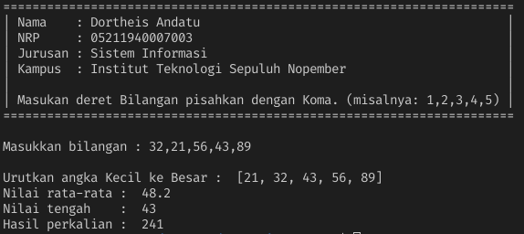

## Program Sederhana menggunakan Python
---

### Demo Program :

### Cara menggunakan Aplikasi
* git clone https://github.com/antheiz/simple_program.git
* cd simple_program
* python main.py
* masukan deret bilangan yang dipisahkan    dengan koma
    - contohnya : 32,21,56,43,89    

### Develop by :
* Dortheis Andatu

